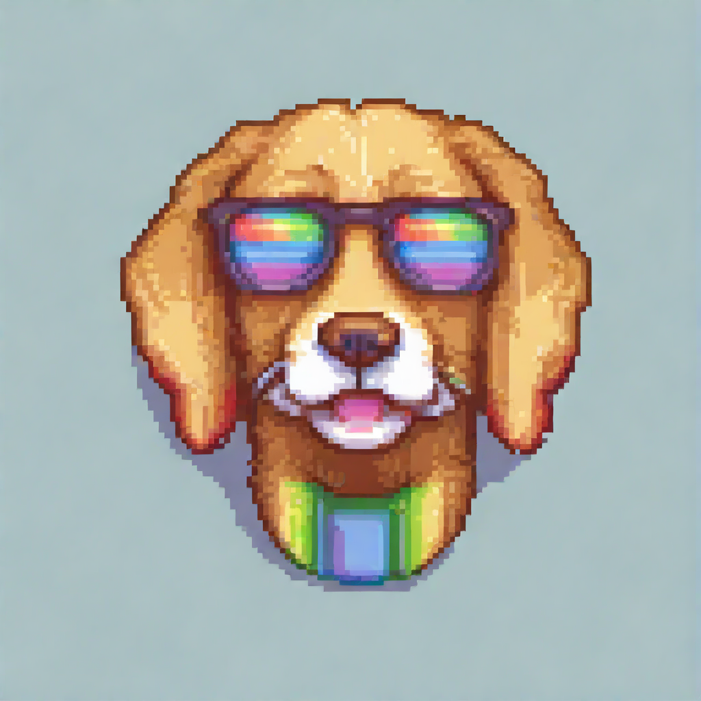

# PixelArtGen

<p align="center">
    
</p>

Utilities for generating and manipulating pixel art.

## Quick Start

Clone the repository and set the current working directory to the root of the repository:

```bash
git clone git@github.com:FreddyWordingham/PixelArtGen.git
cd PixelArtGen
```

Create a virtual environment and install the dependencies:

```bash
poetry env use python3.10
poetry install
```

## Usage

Generate an image:

```bash
poetry run python scripts/generate_images.py --prompt "A golden retriever" --num_images 7
```
